# Project Handover & Client Alignment Brief
**Project:** Luxura Furniture & Associated Digital Platforms  
**Date:** July 24, 2026  
**Document Version:** 1.0  

---

## 1. Handover Explanation & Team Continuity Statement

### Background & Transition Overview
To ensure seamless scaling and dedicated technical support, our team has completed a structured internal transition for the **Luxura Furniture** project. The project leadership and development management have been transferred from Anas to our dedicated project team with zero disruption to active development.

### How the Handover Was Managed
1. **Full Context Transfer:** All notes, meeting recordings, direct instructions, and architectural specifications recorded during past sessions with Anas have been audited and cataloged.
2. **Repository & Infrastructure Sync:** All core code repositories (`luxurafurniture`, `admin-luxura`, `The JJ`), environment configurations, database schemas (Supabase), and media assets were transferred and verified across all environments.
3. **Quality & Standard Assurance:** The team has conducted code reviews and design compliance checks to guarantee that all aesthetic guidelines, private access logic, and data flows align perfectly with previous client agreements.

---

## 2. Transferred Assets & Information Audit Checklist

The table below confirms all transferred items and their current verified status:

| Category | Transferred Assets & Information | Status | Verification Notes |
| :--- | :--- | :--- | :--- |
| **Brand Details & Aesthetic** | - Curated luxury color palette (Lux Dark, Lux Gold, Glassmorphism gradients) - Typography specifications (Serif headers & clean sans body) - Dark mode & editorial showcase layouts | Verified | Applied across Next.js components and CSS design systems. |
| **Product Information & Catalog** | - Catalog structure (5,000+ curated luxury pieces) - Category normalization & tier definitions - Non-downloadable private catalogue viewing model | Verified | Database schema & Supabase storage buckets fully wired. |
| **Files & Media Assets** | - High-resolution product images & WebP optimized assets - Editorial showcase imagery - Digital magazine PDF/image upload formats | Verified | Active client-side WebP compression and Supabase storage hooks. |
| **Design Preferences** | - Glassmorphism access panels with blur effects - Sleek micro-animations and smooth hover transitions - Mobile-responsive layouts with touch optimization | Verified | Implemented across landing pages, Sourcing Showcase, & private catalogue access. |
| **Specific Requests & Security** | - OTP-based request flow & rate limiting - Secure Supabase RPC functions (`check_inquiry_exists`) to bypass default RLS securely - Mass deletion & isolated floating uploader scrolling in admin portal | Verified | Live in production components with clean git histories. |

---

## 3. Comprehensive Project Understanding

### A. Main Client Portal (`luxurafurniture`)
- **Technology Stack:** Next.js (App Router), TypeScript, Tailwind CSS, Supabase Integration.
- **Core Purpose:** High-end, invitation-only digital luxury furniture catalogue showcasing global sourcing and bespoke pieces.
- **Key Modules Implemented:**
  - **Editorial Hero & Showcase:** Immersive visual presentation highlighting luxury interior collections.
  - **Private Catalogue Access:** "Invitation Only" gated portal requiring verified access requests.
  - **Sourcing Showcase:** Global supply chain overview featuring 5,000+ curated pieces.
  - **OTP & Contact Rate Limiting:** Secure verification endpoints protecting user privacy and preventing spam.

### B. Admin Management Portal (`admin-luxura`)
- **Technology Stack:** Next.js, WebP Client Compression, Supabase Administration API.
- **Core Purpose:** Centralized management system for uploading, editing, and managing magazines, product categories, and media assets.
- **Key Modules Implemented:**
  - **Magazine Upload Form:** Tier and section dropdowns for granular content categorization.
  - **Floating Uploader:** Isolated scroll container ensuring smooth multi-file uploads without layout shifting.
  - **Mass Deletion Tooling:** Bulk management capabilities for catalog cleanup.

### C. Secondary Web Assets (`The JJ`)
- **Technology Stack:** Vite, HTML5, Vanilla CSS/JS, Supabase integration.
- **Core Purpose:** Specialized portfolio and community showcase portal supporting client ecosystem offerings.

---

## 4. Proposed Alignment Meeting Agenda

To ensure 100% alignment and address any remaining questions before proceeding with the next phase, we propose the following agenda for our upcoming meeting:

```mermaid
gantt
    title Alignment Meeting Agenda (45 Minutes)
    dateFormat  m
    axisFormat %M min

    section Introduction & Handover
    Team Intro & Handover Summary       :active, m1, 0, 10m
    
    section Project Review
    Live Walkthrough of Portals          :m2, 10, 25m
    Review of Brand & Product Details    :m3, 25, 35m

    section Roadmap & Q&A
    Upcoming Milestones & Feedback       :m4, 35, 45m
```

### Detailed Agenda Steps:
1. **Welcome & Team Introduction (10 mins):** Brief introduction of key team members managing technical execution and client communications.
2. **Project Walkthrough & Feature Verification (15 mins):** Demonstrating the live client portal, private catalogue request flow, and admin magazine management.
3. **Requirement Confirmation (10 mins):** Reviewing specific brand details, product categories, and custom requests to confirm complete accuracy.
4. **Q&A, Feedback & Next Milestones (10 mins):** Answering any questions and agreeing on next development deliverables.

---

## 5. Next Action Items

1. **Share this document** with the client along with the meeting invitation.
2. **Confirm meeting date & time** based on client availability.
3. **Conduct the alignment presentation** using live walkthroughs of `luxurafurniture` and `admin-luxura`.
